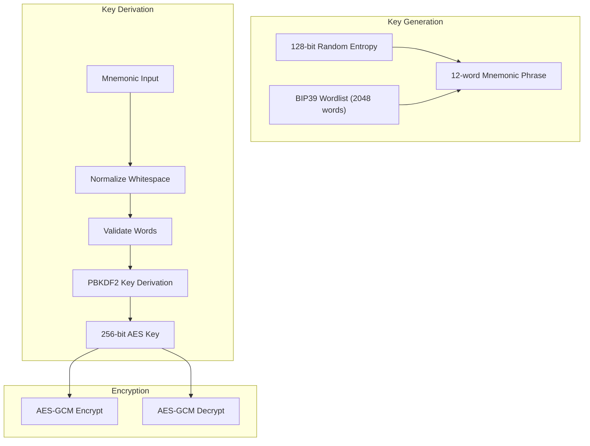

# Design Document: Mnemonic Vault Key

## Overview

Fitur ini mengubah sistem vault key dari format base64 menjadi mnemonic phrase (12 kata acak). Implementasi menggunakan BIP39-style wordlist untuk generate kata-kata yang mudah dibaca dan diingat. Mnemonic phrase kemudian dikonversi menjadi cryptographic key menggunakan PBKDF2.

## Architecture



## Components and Interfaces

### Mnemonic Module (`src/lib/mnemonic.ts`)

```typescript
// BIP39-style wordlist (2048 English words)
export const WORDLIST: string[];

// Generate a new 12-word mnemonic phrase
export function generateMnemonic(): string;

// Validate a mnemonic phrase
export function validateMnemonic(mnemonic: string): { valid: boolean; error?: string };

// Normalize mnemonic (trim, lowercase, single spaces)
export function normalizeMnemonic(mnemonic: string): string;

// Convert mnemonic to bytes for key derivation
export function mnemonicToBytes(mnemonic: string): Uint8Array;
```

### Updated Crypto Module (`src/lib/crypto.ts`)

```typescript
// Generate vault key as mnemonic phrase (replaces old generateVaultKey)
export async function generateVaultKey(): Promise<string>;

// Derive encryption key from mnemonic
async function deriveKeyFromMnemonic(mnemonic: string, salt: Uint8Array): Promise<CryptoKey>;
```

### UI Components

```typescript
// CreateVault page - displays mnemonic after creation
interface CreateVaultState {
  mnemonic: string | null;
  isCreating: boolean;
}

// SignIn page - accepts mnemonic input
interface SignInState {
  mnemonic: string;
  error: string | null;
  isSigningIn: boolean;
}
```

## Data Models

### Mnemonic Generation Process

1. Generate 128 bits (16 bytes) of cryptographically secure random data
2. Split into 11-bit chunks (128 / 11 ≈ 11.6, padded to 12 words)
3. Map each chunk to a word from the 2048-word list
4. Result: 12 words providing 132 bits of entropy

### Key Derivation Process

1. Normalize mnemonic (lowercase, single spaces)
2. Convert mnemonic string to UTF-8 bytes
3. Use PBKDF2 with:
   - Password: mnemonic bytes
   - Salt: random 16 bytes (stored with ciphertext)
   - Iterations: 100,000
   - Hash: SHA-256
4. Output: 256-bit AES-GCM key

## Correctness Properties

*A property is a characteristic or behavior that should hold true across all valid executions of a system—essentially, a formal statement about what the system should do.*

### Property 1: Generated Mnemonic Structure

*For any* generated mnemonic phrase, it should contain exactly 12 words, and all words should be from the valid wordlist.

**Validates: Requirements 1.1, 1.2**

### Property 2: Mnemonic Validation Correctness

*For any* string input:
- If it contains exactly 12 words all from the wordlist, validation should pass
- If it contains != 12 words OR any word not in wordlist, validation should fail

**Validates: Requirements 2.2, 2.3**

### Property 3: Mnemonic Normalization Idempotence

*For any* mnemonic string, normalizing it twice should produce the same result as normalizing once (idempotent).

**Validates: Requirements 4.4**

### Property 4: Key Derivation Consistency

*For any* valid mnemonic phrase, deriving a key multiple times with the same salt should produce the same key.

**Validates: Requirements 2.1**

### Property 5: Whitespace Flexibility

*For any* valid mnemonic with extra whitespace (multiple spaces, tabs, newlines), the normalized form should be equivalent to the clean version.

**Validates: Requirements 4.4**

## Error Handling

| Scenario | Handling |
|----------|----------|
| Mnemonic has wrong word count | Show error: "Mnemonic must be exactly 12 words" |
| Mnemonic contains invalid word | Show error: "Invalid word: {word}" |
| Empty mnemonic | Show error: "Please enter your vault key" |
| Decryption fails | Show error: "Invalid vault key or corrupted data" |

## Testing Strategy

### Unit Tests
- Test mnemonic generation produces 12 words
- Test validation accepts valid mnemonics
- Test validation rejects invalid mnemonics
- Test normalization handles various whitespace

### Property-Based Tests
- Use fast-check library for TypeScript
- Minimum 100 iterations per property test
- Test generated mnemonics always valid
- Test normalization idempotence
- Test validation correctness

### Test Configuration
```typescript
// Property test annotation format
// Feature: mnemonic-vault-key, Property N: {property_text}
```
