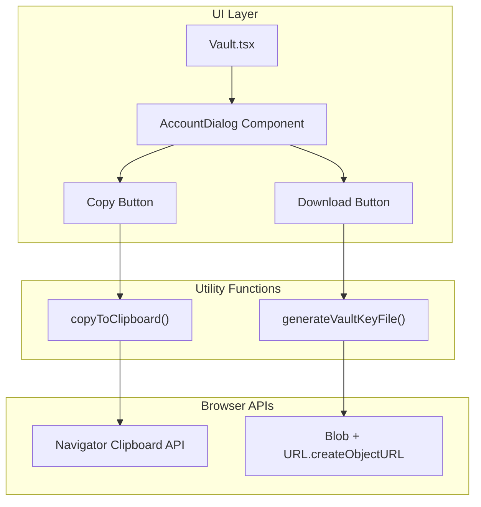

# Design Document: Vault Key Management

## Overview

Fitur ini menambahkan kemampuan copy dan download vault key pada Account Dialog di aplikasi Private Notes Vault. Implementasi akan menggunakan komponen React yang sudah ada dengan penambahan fungsi utilitas untuk clipboard dan file download.

## Architecture



## Components and Interfaces

### AccountDialog Component

Komponen dialog baru yang menampilkan informasi akun vault dengan fitur copy dan download.

```typescript
interface AccountDialogProps {
  open: boolean;
  onOpenChange: (open: boolean) => void;
  vaultId: string;
  vaultKey: string;
  onSignOut: () => void;
}
```

### Utility Functions

```typescript
// Copy vault key to clipboard
async function copyToClipboard(text: string): Promise<boolean>;

// Generate downloadable vault key file content
function generateVaultKeyFileContent(vaultId: string, vaultKey: string): string;

// Trigger file download
function downloadTextFile(content: string, filename: string): void;
```

## Data Models

### Download File Format

```
=====================================
PRIVATE NOTES VAULT - VAULT KEY
=====================================

⚠️ WARNING: Keep this file secure!
This vault key is the ONLY way to access your encrypted notes.
If you lose it, your notes cannot be recovered.

Vault ID: {vaultId}
Vault Key: {vaultKey}

Generated: {timestamp}
=====================================
```

## Correctness Properties

*A property is a characteristic or behavior that should hold true across all valid executions of a system—essentially, a formal statement about what the system should do. Properties serve as the bridge between human-readable specifications and machine-verifiable correctness guarantees.*

### Property 1: Clipboard Copy Integrity

*For any* vault key string, when copied to clipboard, reading from clipboard should return the exact same string.

**Validates: Requirements 1.1**

### Property 2: Visual Feedback State Transition

*For any* successful copy operation, the button state should transition from "copy" to "copied" and back to "copy" after 2 seconds.

**Validates: Requirements 1.2**

### Property 3: Download File Content Completeness

*For any* vault ID and vault key combination, the generated download file content should contain:
- The exact vault ID
- The exact vault key  
- A security warning message

**Validates: Requirements 2.1, 2.2, 2.5**

### Property 4: Download Filename Format

*For any* vault ID, the generated filename should match the pattern `vault-key-{first8chars}.txt` where `{first8chars}` is the first 8 characters of the vault ID.

**Validates: Requirements 2.3**

## Error Handling

| Scenario | Handling |
|----------|----------|
| Clipboard API not available | Show error toast, suggest manual copy |
| Clipboard write fails | Show error toast with specific message |
| Download fails | Show error toast |
| Empty vault key | Disable copy/download buttons |

## Testing Strategy

### Unit Tests
- Test `generateVaultKeyFileContent()` returns correct format
- Test filename generation with various vault IDs
- Test component renders correctly with props

### Property-Based Tests
- Use fast-check library for TypeScript
- Minimum 100 iterations per property test
- Test clipboard round-trip with random strings
- Test file content contains all required elements for random vault IDs/keys

### Test Configuration
```typescript
// Property test annotation format
// Feature: vault-key-management, Property N: {property_text}
```
